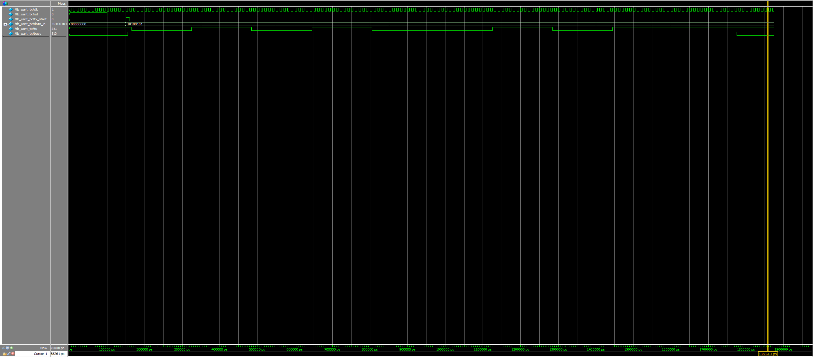

# UART Transmitter Test Project

This project implements a simple UART transmitter (`uart_tx.v`) in Verilog, along with a testbench (`tb_uart_tx.v`) to verify the design using simulation. The transmitter sends an 8-bit data byte with standard UART framing: 1 start bit, 8 data bits (LSB first), and 1 stop bit.

## 🔧 Files Included

| File Name        | Description                     |
|------------------|---------------------------------|
| `uart_tx.v`      | UART transmitter RTL design     |
| `tb_uart_tx.v`   | Testbench for verifying `uart_tx` |
| `RTL_uart_tx.pdf`| Block diagram of the design     |
| `wave_tb_uart_tx.png` | Simulation waveform output |

## 🧩 RTL Architecture

The UART transmitter FSM has the following states:

- **IDLE**: Wait for `tx_start`
- **START**: Send logic 0 (start bit)
- **DATA**: Shift out 8 bits, LSB first
- **STOP**: Send logic 1 (stop bit)
- **DONE**: Return to IDLE

## 📈 Simulation Waveform

Simulation was done using ModelSim. The following waveform illustrates the transmission of `0xA5`:

## 🧪 Test Description

The testbench:
1. Resets the system.
2. Loads data `0xA5` into `data_in`.
3. Asserts `tx_start` for one clock cycle.
4. Waits until `busy` returns to 0.
5. Ends the simulation with `$finish`.

## 🛠️ Toolchain

- **Design Entry & Synthesis**: Quartus Prime Lite
- **Simulation**: ModelSim Intel FPGA Edition 10.5b

---

Feel free to clone, study, or modify the project as a foundation for more advanced UART designs.

